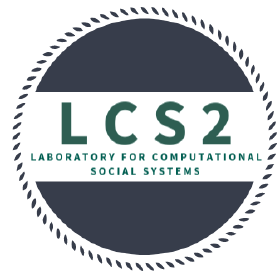

# LCS2-Common

Repo for Links and resources related to LCS2 server, reading group, events calendar.

# Reading Group
Current Time: Monday, 6-7.30 PM. @A-420, R & D Building, IIITD.

## Talk Schedule

| Date       | Presenter     |  Topic     | Resource Links |
|-------------|--------|--------|---------|
| 04/9/2023 | *LCS2 Members*:  Megha, Siddhant, Manav & Indraayudh | Prompt Engineering, Prompt Tuning   | [Resources](https://drive.google.com/drive/u/0/folders/1BH5quxhGzd6RYRfneU-SDVhqusqKYkpr) |
| 28/8/2023 | *LCS2 Members*:  Amey, Neemesh & Neelabh | Advanced LLMs - Llamma, Alpacha, Vicuna, LLava   | [Resources](https://drive.google.com/drive/u/0/folders/1vlBe2mghS5M4NKa5yl0uoWt-bEu8CnGO) |
| 21/8/2023 | *LCS2 Members*:  Aseem & Ayush | InstructGPT(RLHF, PPO) and TRL  | [Resources](https://drive.google.com/drive/u/0/folders/1Nl3KG-fQLVkachNAn7yEwBxl1ydcC3-y) |
| 14/8/2023 | *LCS2 Members*:  Gauri & Shubhanshu | LLMs - Applications, Survey (Bert, Elmo, GPT, BARD, etc.)  | [Resources](https://drive.google.com/drive/u/0/folders/1j8kiqEDsRKXaoduxAD-1VGKUOD-rMF2D) |
| 7/8/2023 | *LCS2 Members*:  Indrayudh, Neeraj & Shivani | Attention-Transformers : Bahandanu, Vaswani, Flash, Flash2  | [Resources](https://drive.google.com/drive/u/0/folders/15U4-pSqbfkhlLWrzzfbj4uuT-96XWKDO) |
| 4/9/2020 | **Guest Speaker**: Tulika Saha, IIT-Patna :india:| Dialogue Management Strategy |-|
| 11/9/2020 | *LCS2 Members*: Shivani & Sanjana | Introduction to BERT | [BERT Paper](https://arxiv.org/pdf/1810.04805.pdf) |
| 18/9/20 | *LCS2 Members*: Abdul & Aseem | Discussion on GPT |[GPT Blog](https://huggingface.co/transformers/model_doc/gpt.html), [GPT Paper](https://cdn.openai.com/research-covers/language-unsupervised/language_understanding_paper.pdf) |
| 25/9/20 | *LCS2 Members*: Shreya & Megha | Discussion on XLNeT | [HuggingFace Blog](https://huggingface.co/transformers/model_doc/xlnet.html), [XLNeT Paper](https://arxiv.org/abs/1906.08237) |
| 8/10/2020 | *LCS2 Members*: Kartik & Hridoy | Discussion on XLM | [UNMT Blog](https://yashuseth.blog/2019/03/03/how-can-unsupervised-neural-machine-translation-work/), [XLM Blog](https://towardsdatascience.com/xlm-cross-lingual-language-model-33c1fd1adf82), [XLM Paper](https://arxiv.org/abs/1911.02116) |
| 30/10/2020 | *LCS2 Members*: Kishan | Discussion on RoBERTa  | [RoBERTa Paper](https://arxiv.org/abs/1907.11692)  |
| 6/11/2020 | *LCS2 Members*: Shraman & Shivam | Discussion on MMBT | [MMBT paper](https://arxiv.org/abs/1909.02950), [Factorized Multimodal Transformer (Current SOTA)](https://openreview.net/attachment?id=BJxD11HFDS&name=original_pdf)  |
| 13/11/2020 | *LCS2 Members*: Sarah| Overview of Model Distillation and Compression | [Distill Bert](https://arxiv.org/pdf/1910.01108.pdf), [TinyBert](https://openreview.net/attachment?id=rJx0Q6EFPB&name=original_pdf), [MobileBERT](https://arxiv.org/abs/2004.02984), [ALBERT](https://arxiv.org/pdf/1909.11942.pdf), [Official Distill Bert Blog](https://medium.com/huggingface/distilbert-8cf3380435b5) |
| 20/11/2020 | *LCS2 Members*: Abdul & Yash | Discussion on T5 | [T5 Paper](https://arxiv.org/pdf/1910.10683.pdf), [Mesh Tensorflow](https://arxiv.org/abs/1811.02084), [T5 Repo](https://github.com/google-research/text-to-text-transfer-transformer), [Mesh Tensorflow](https://github.com/tensorflow/mesh) |
| 27/11/2020 | *LCS2 Members*: Manjot & Aseem | Hands-on session on BART| [BART Paper](https://ai.facebook.com/research/publications/bart-denoising-sequence-to-sequence-pre-training-for-natural-language-generation-translation-and-comprehension/), [Hugging Face Implementation](https://huggingface.co/transformers/model_doc/bart.html) |
| 4/12/2020 | *LCS2 Members*:  Ganeshan & Shivani | Discussion on DialoGPT | [DialoGPT Paper](https://arxiv.org/abs/1911.00536), [Code](https://huggingface.co/transformers/model_doc/dialogpt.html)|

### Presentation Archives:
Slides from talks are updated [here](https://drive.google.com/drive/folders/1__p6NWTCM2qAqBhSuE7XsdXMZAnUrFQk).
Other Relevant resources are maintained [here](https://drive.google.com/drive/u/0/folders/1rYTxTxLY9iAqj2dcTk1mKAO6nWGsxrO-)
### Suggested Papers:
We maintain a pool of suggested papers and resources [here](https://docs.google.com/spreadsheets/d/1BkVpsIs9reOGooat7gTFisEMyb_ZV7fwy_vTPtC0--s/edit#gid=2065871435).
